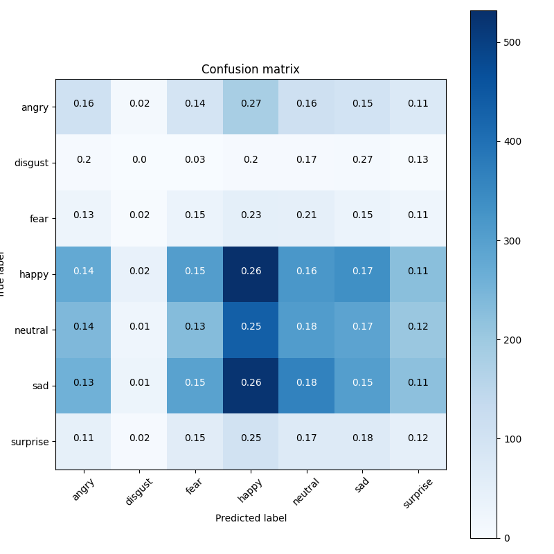
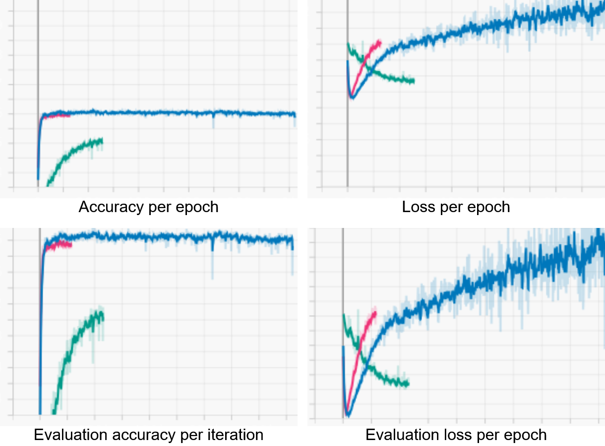

# Expression recognition using Tensorflow
Enhanced with facial detection to ensure the only regions we are detecting over have faces in them

## Usage

There are 2 mandatory arguments when running the program:
 - `model` - The name (or location) of your model file. If it doesn't exist, the program will save it there when it finishes training the model. A pre-trained model `128_epochs.keras` is provided in this repository
 - `train` - A path to the training images folder that has subfolders of images, divided by class

And 5 more optional arguments:
 - `-e` or `--epochs` - Specifies how many epochs the training should go over. By default this is 16
 - `-fc` or `--cascade` - Path to a face cascade file. By default it looks for `haarcascade_frontalface_alt.xml`
 - `-v` or `--validate` - Accepts the same argument as `model`, but for the validation folder. It will output to a text file
 - `-s` or `--source` - Specifies either a path to a static image or video, or a number for a camera source. By default its value is 0
 - `c` or `--custom` - Will use my custom method for loading data rather than the Tensorflow one. Warning: it's very slow, but it checkpoints its progress to pick up where it left off

Examples: 
```
python main.py 128_epochs.keras images/train
python main.py 128_epochs.keras images/train -s videos/people_doing_things.mp4 -v images/validation
```

## Functionality
This section contains explanations of snippets of code and why I chose to make them as such.

### Model config
Arguably the most important one is the shape of the model itself:
```python
model = Sequential([
        Input(shape=(48, 48, 1)),
        Rescaling(1./255),
        Conv2D(128, 9, activation='relu'),
        MaxPooling2D(),
        Dropout(0.5),
        Conv2D(256, 6, activation='relu'),
        MaxPooling2D(),
        Dropout(0.5),
        Conv2D(512, 3, activation='relu'),
        MaxPooling2D(),
        Dropout(0.5),
        Flatten(),
        Dense(128, activation='relu'),
        Dense(64, activation='relu'),
        Dense(num_classes, activation='softmax', name='outputs')
    ])
```
The images are 48x48. Past iterations of the model had varying combinations - (512, 3), (8, 9), (128, 5) - for the filter and kernel size for Conv2D, but I ultimately decided to keep the kernel to 9, 6, and 3 (takes a 3x3, 6x6, and 9x9 window of pixels) on each step and the 128, 256, and 512 filters are powers of 2, and I like said numbers. The layers went through many iterations, most of which aren't in the commit history, but the model seems to predict just fine with the current layers. It does, however, still have issues, and I will go over them below.

`Rescaling(1./255)` is used to normalize the pixel values of every image before the rest of the processing continues.

`MaxPooling2D()` is a common layer to add, and by default it operates over a 2x2 window, taking the max value of each window.

`Dropout(0.5)` is used to prevent overfitting by turning some inputs to 0 at the given rate (0.5). We will see how a large value affects the results later.

The final dense layer is practically mandatory which normalizes the values of the previous input to ensure a sum of probabilities of all classes to equal 1, and outputs the amount of classes we have.

### Custom data loading methods
The following is the method that loads images and adds a class to them based on their folder, and outputs each pair into a .csv file:
```python
if not os.path.isfile(f"{outPath}/{outFile}"):
        dir_names_input = os.listdir(inputFolderPath)
        path_class_dict = {}

        for i in range(len(dir_names_input)):
            path_class_dict[dir_names_input[i]] = i
        df = pd.DataFrame(columns=["filename", "label"])

        for dirpath, dirs, filename in os.walk(f"{inputFolderPath}"):
            pathname = os.path.split(dirpath)[-1]
            if path_class_dict.get(pathname) is not None:
                current_class_temp_list = len(filename)*[path_class_dict.get(pathname)]
                df = pd.concat([pd.DataFrame(zip(filename, current_class_temp_list), columns=df.columns), df], ignore_index=True)

        df.to_csv(f"{outPath}/{outFile}", index=False)
```
The largest issue it has is that it is *extremely* slow, thanks to Python's innate inability to function at the same rate as C/C++ wrappers would.

This method does the opposite - it recursively searches for each image and its class and loads them into their respective list:
```python
for index, row in df.iterrows():
        image_path = list(p.rglob(row['filename']))
        image_loader = cv2.imread(image_path[0])
        if image_loader is not None:
            loaded_images.append(image_loader)
            labels.append(row['label'])
        else: print(f"Unable to load {image_path}.")
```
Do note that while *somewhat* faster, its primary use is to validate the model using `model_works.validate_model()`. If you use it to predict each image/frame, you would need to define the dictionary for the class names in alphabetical order yourself.

I haven't measured the total time it takes for both of these to complete, but it takes around 3-5 minutes to save to a .csv and then load the images based on it.

## Statistics and analysis
### Predictions


As you can see, these images hold the outline for the area in which a face was detected, and has a predicted class as well as a confidence level at the top. For some images, it may be somewhat difficult to tell due to the choice of colors (especially for the surprised face) since these photos are of varying dimensions and quality. I made sure to leave the original images in the showcase folder if you wish to look at them closely.

I made sure to include predictions of different confidence levels and those that had a mismatch between the predicted and true class. These predictions might coincide with the confusion matrices.

### Confusion matrix
I decided to train a few models with different parameters and epochs for the sake of testing. Most of them gave me similar results when it came to the CM, so here is the one with 256 epochs:



As you can see, the results are catastrophic. There are no two ways about it. This is the primary reason I kept tinkering with the model's parameters before I came to a set of numbers I deemed... mostly satisfactory.

At first, I was simply baffled by the matrix, but upon further research, other attempts at making an emotion recognition model based on this dataset yielded similar results. Once I saw their models' layers, I thought that either 
 - The model wasn't optimized for the dataset or
 - The dataset isn't the best (considering the images are 48x48 - extremely pixelated - sometimes even I had trouble telling what was shown)

There was little I could do in regards to this, as the many variations of the model I had made little to no impact on the results, *except* for the one whose snippet is at the very top of the readme. In truth, the latest iteration only reduced the loss per epoch, but that's only at the cost of having a large `Dropout` value.

### Graphs


The blue line represents the statistics for the 1024 epochs variation, the pink is for the 128 epochs variation, and the green is for 256 epochs. As you can see, the first two variations have similar graphs, both capping out at about 60% accuracy, while their loss skyrockets after the first 30 epochs. The 3rd variation has an accuracy of approximately 50% at its final epoch.

I suppose that one advantage to having a large dropout value in multiple places is that the loss per epoch has a potential equilibrium at 1.0, and its accuracy has yet room to grow. Perhaps if this variation of the model is ran for another 256, or even up to 1024 or more epochs, it will cleanly surpass the previous two, and potentially return a better confusion matrix.

### Dataset
The dataset was taken from [kaggle](https://www.kaggle.com/datasets/jonathanoheix/face-expression-recognition-dataset).

### What next?
An important step of making such models is hyperparameter optimization. Tensorflow has built-in methods, however, I have left this step out for now, and I might revisit it in the future. While it is a crucial step in getting the most accurate model possible, I think that the model is accurate *enough* as is, and serves its purpose - a showcase of my abilities to create it.
